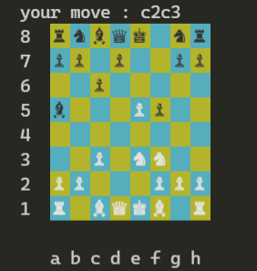

command-line-chess
==================
> Inspired by [command-line-chess](https://github.com/marcusbuffett/command-line-chess.git)

A python program to play chess against an AI in the terminal.

## Technical stuff

The AI is a simple brute-force AI with no pruning. It evaluates a given position by counting the value of the pieces for each side (pawn -> 1, knight/bishop -> 3, rook -> 5, queen -> 9). It will evaluate the tree of moves, and take the path that results in the greatest gain. To learn more, check out [original post on how it works](https://mbuffett.com/posts/chess-ai/).
